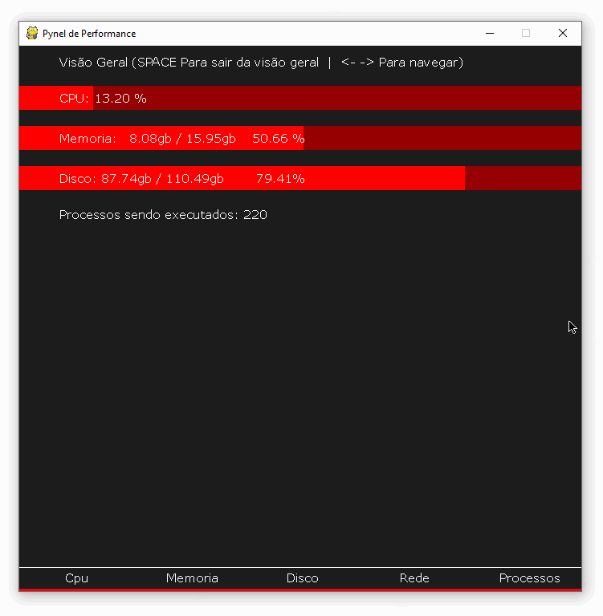

# Pynel Performance

Control panel for remote graphical resource monitoring. Created with clint-server architecture, enabling multiples clients
to connect with the same server via sockets.



Usage (Server)
---
```
git clone https://github.com/guiquintelas/pynel-performance.git
cd pynel-performance
pip install -r requeriments.txt
python -m server.main
```

Usage (Client)
---
```
git clone https://github.com/guiquintelas/pynel-performance.git
cd pynel-performance
pip install -r requeriments.txt
python -m client.main
```

Controls
---

- **left**: previous view
- **right**: next view
- **space**: toggle general view